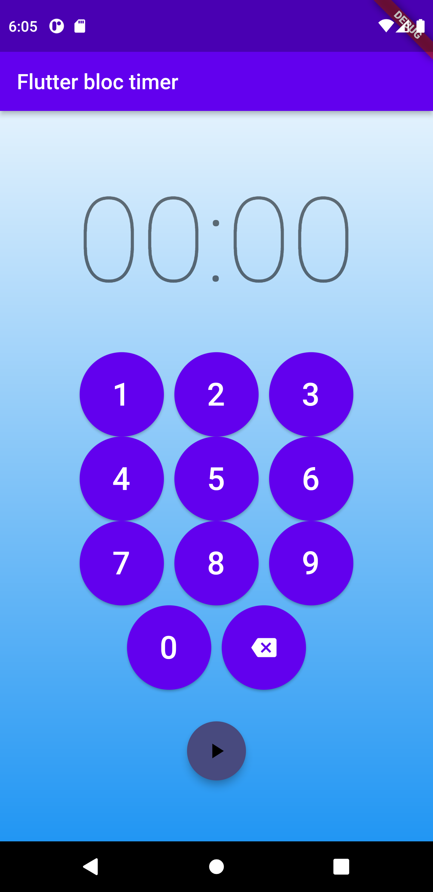
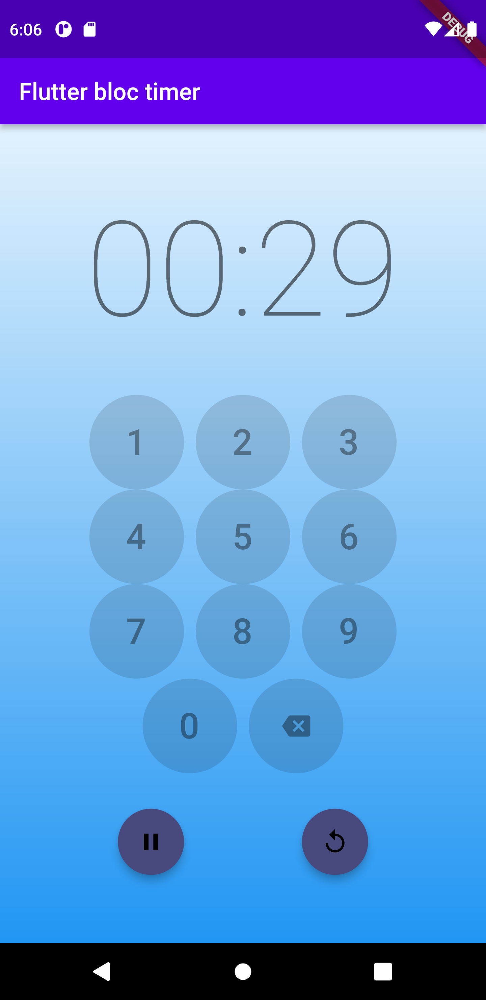

# timer_bloc_tutorial
Just an application that i build by following Bloc official tutorial with some extra feature that i added.

the feature that i added is some kind of num pad so the user can set the timer to anything the user want to.

## Screenshots

